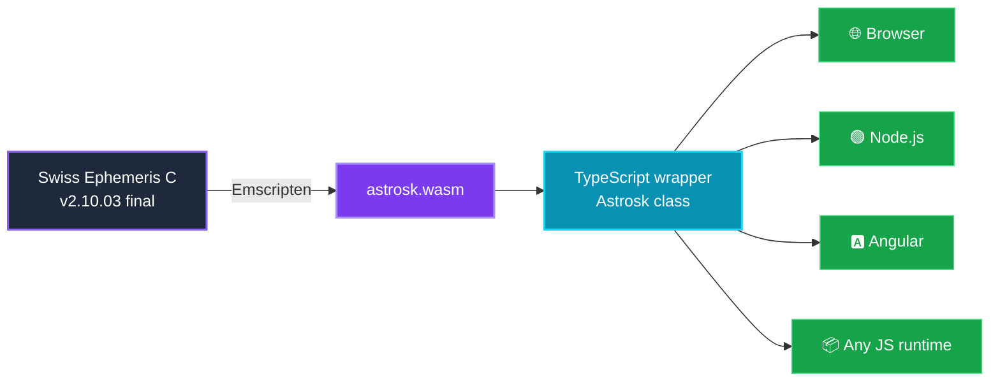
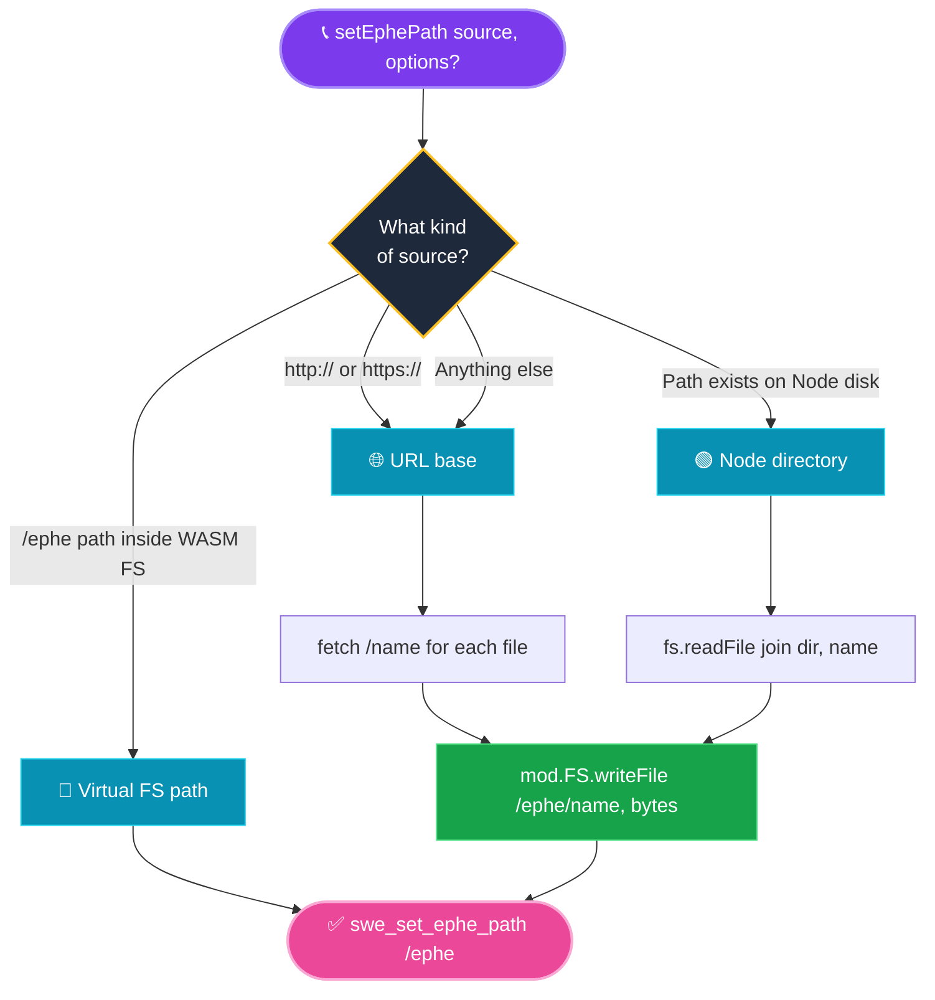
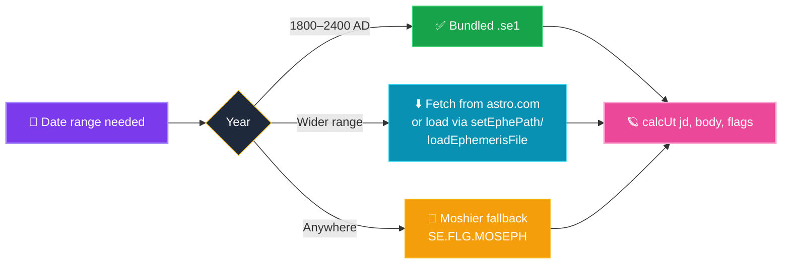
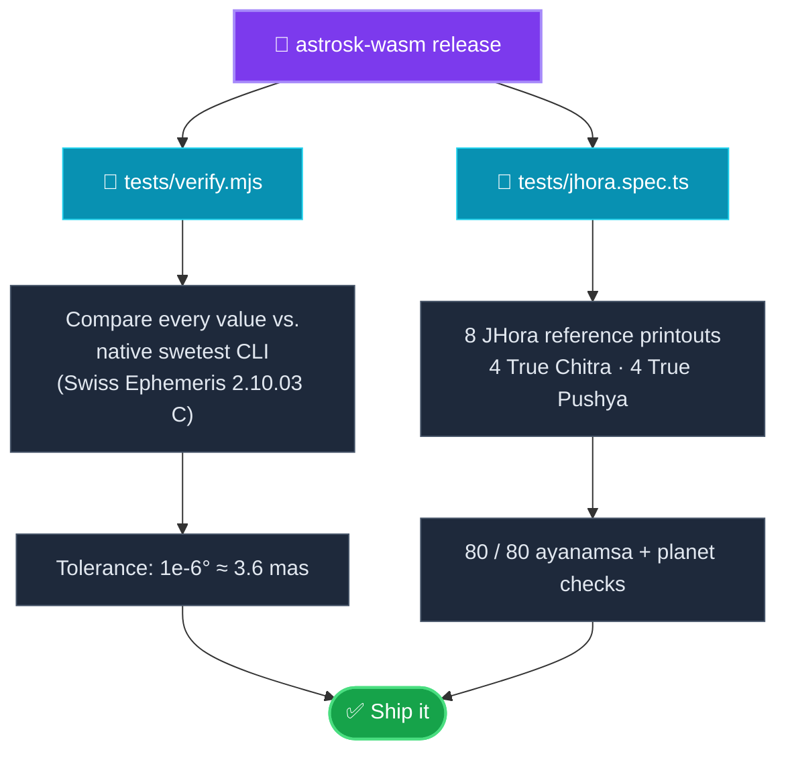

<div align="center">

# 🌌 astrosk-wasm

### *Swiss Ephemeris, reborn in WebAssembly*

**Lightweight · TypeScript-first · Browser + Node + Angular**

[](https://www.npmjs.com/package/astrosk-wasm)
[](./LICENSE)
[](https://www.astro.com/swisseph/)
[](https://nodejs.org/)
[](https://www.typescriptlang.org/)

[](#-verified-against-jagannatha-hora)
[](#-verified-against-jagannatha-hora)

🌐 **[astrosk.com](https://astrosk.com)** &nbsp;·&nbsp; 📦 **[npm](https://www.npmjs.com/package/astrosk-wasm)** &nbsp;·&nbsp; 🐙 **[GitHub](https://github.com/skota-in/astrosk-wasm)**

</div>

---

## ✨ What is this?

**`astrosk-wasm`** ports the official **Swiss Ephemeris C library** (`2.10.03` — the final upstream release) to **WebAssembly**, so you get the *exact same* astronomical math the reference C implementation produces — now usable from the browser, Node, or any modern JS runtime.



---

## 🎯 Features at a glance

| | |
|---|---|
| 🪐 **Planetary positions** | Sun, Moon, planets, nodes, asteroids — tropical or sidereal |
| 🏠 **House systems** | Placidus, Koch, Equal, Whole Sign, and 20+ more |
| 🕉️ **Vedic / sidereal** | True Chitra, True Pushya, Lahiri, Krishnamurti, and dozens more |
| ⚡ **Pre-allocated scratch** | Reusable heap buffers — fast in the hot path |
| 🧭 **Smart `setEphePath`** | Auto-detects URL · Node dir · virtual FS — one method, all environments |
| 📦 **Tree-shakeable** | Tiny TS wrapper; WASM is fetched on demand |
| 🧪 **Verified** | 80/80 JHora reference checks + `swetest` C-binary parity on every build |

---

## ✅ Verified against Jagannatha Hora

> 🪷 **Vedic astrologers can trust the numbers.**

Every release is validated against **8 reference charts produced by Jagannatha Hora 8.0** (PVR Narasimha Rao):

<table>
<tr>
<th>Ayanamsa</th>
<th>Charts</th>
<th>Coverage</th>
<th>Tolerance</th>
</tr>
<tr>
<td>🌟 <b>True Chitra</b></td>
<td>4</td>
<td rowspan="2">🇮🇳 India · 🇺🇸 USA · 🇯🇵 Japan · 🇬🇧 UK<br/>2010–2025</td>
<td rowspan="2">Sub-arcsecond ✨<br/>(80/80 checks pass)</td>
</tr>
<tr>
<td>💎 <b>True Pushya</b></td>
<td>4</td>
</tr>
</table>

The reference printouts live in [`examples/chart{1..8}.txt`](./examples) and the test runs locally:

```bash
🛠  npm run build
🧪  npm run test:jhora
```

### 🎓 How to call the API to match JHora

JHora displays the **mean / geometric** sidereal position — *no nutation, no light-time aberration*. To reproduce its output, combine `SWIEPH | NONUT | TRUEPOS` on every ayanamsa and `calcUt` call:

```ts
import { Astrosk, SE } from 'astrosk-wasm';

const astrosk = await Astrosk.init();

// 1️⃣  Pick the ayanamsa JHora is configured for.
astrosk.setSidMode(SE.SIDM.TRUE_PUSHYA);   // or TRUE_CITRA, LAHIRI, etc.

// 2️⃣  Convert local civil time → UT, then to a Julian Day.
//      JHora prints "Time Zone: 5:30:00 (East of GMT)" → UT = local - 5.5h.
const jdUt = astrosk.julday(2025, 5, 10, 5.2395);   // 10:44:22 IST = 05:14:22 UT

// 3️⃣  Read the ayanamsa with the JHora-matching flags.
const JHORA = SE.FLG.SWIEPH | SE.FLG.NONUT | SE.FLG.TRUEPOS;
const ayanamsa = astrosk.getAyanamsaExUt(jdUt, JHORA);

// 4️⃣  Compute sidereal planet longitudes with the same flags + SIDEREAL.
const sun = astrosk.calcUt(jdUt, SE.SUN, JHORA | SE.FLG.SIDEREAL | SE.FLG.SPEED);
console.log(sun.longitude);   // matches JHora's "Sun ... longitude" line

// 5️⃣  Ketu is geometric: Rahu + 180°.
const rahu = astrosk.calcUt(jdUt, SE.MEAN_NODE, JHORA | SE.FLG.SIDEREAL | SE.FLG.SPEED);
const ketu = (rahu.longitude + 180) % 360;
```

> ⚠️ If you instead use plain `SE.FLG.SWIEPH`, you get the **apparent** position (with nutation + aberration applied) — astronomically correct but **20–40 arcsec off JHora's display**. Pick the convention that matches your upstream reference and use it consistently.

---

## 🚀 Install

```bash
npm  install astrosk-wasm
# or
pnpm add     astrosk-wasm
# or
yarn add     astrosk-wasm
```

---

## ⚡ Quick start

```ts
import { Astrosk, SE } from 'astrosk-wasm';

const astrosk = await Astrosk.init();

// 📁 Point Swiss Ephemeris at your ephemeris files.
//    Auto-detects URL base (browser) vs. local directory (Node).
await astrosk.setEphePath('/assets/ephe');           // 🌐 browser
// await astrosk.setEphePath('C:/ephe');             // 🟢 Node, custom dir

// 🗓️  May 10, 2026 11:32:26 UT
const jd = astrosk.julday(2026, 5, 10, 11.540556);

// ☀️  Tropical
const sun = astrosk.calcUt(jd, SE.SUN, SE.FLG.SWIEPH | SE.FLG.SPEED);
console.log('Sun longitude:', sun.longitude); // 49.8273°

// 🕉️  Sidereal (Vedic) — True Pushya ayanamsa (PVR Narasimha Rao)
astrosk.setSidMode(SE.SIDM.TRUE_PUSHYA);
const sunSid = astrosk.calcUt(
  jd, SE.SUN, SE.FLG.SWIEPH | SE.FLG.SIDEREAL | SE.FLG.SPEED,
);
console.log('Sun sidereal:', sunSid.longitude); // 26.7361°

// 🏠 Houses (Placidus)
const houses = astrosk.houses(jd, 42.20278, -71.68611, 'P');
console.log('Ascendant:', houses.ascmc[0]);
console.log('MC:',        houses.ascmc[1]);

astrosk.close();
```

---

## 🔄 How `setEphePath` works

One method, three sources — auto-detected.



Default file list (overridable via `{ files: [...] }`):

| File | Purpose | Size |
|------|---------|------|
| 🪐 `sepl_18.se1`  | Planets, 1800–2400 AD | ~476 KB |
| 🌙 `semo_18.se1`  | Moon, 1800–2400 AD    | ~1.3 MB |
| ⏱️ `seleapsec.txt` | Leap seconds          | tiny    |
| ⭐ `sefstars.txt`  | Fixed stars catalog   | small   |
| 🌀 `seorbel.txt`   | Orbital elements      | small   |

---

## 🅰️ Angular integration

```ts
// src/app/astrosk.service.ts
import { Injectable } from '@angular/core';
import { Astrosk, SE } from 'astrosk-wasm';

@Injectable({ providedIn: 'root' })
export class AstroskService {
  private instance?: Astrosk;
  private initPromise?: Promise<Astrosk>;

  async getInstance(): Promise<Astrosk> {
    if (this.instance) return this.instance;
    if (this.initPromise) return this.initPromise;

    this.initPromise = (async () => {
      const astrosk = await Astrosk.init();
      // 🎯 Auto-detects URL base; fetches the default file set in parallel.
      await astrosk.setEphePath('/assets/ephe');
      this.instance = astrosk;
      return astrosk;
    })();

    return this.initPromise;
  }

  async sunLongitude(date: Date): Promise<number> {
    const a = await this.getInstance();
    const hours = date.getUTCHours()
      + date.getUTCMinutes() / 60
      + date.getUTCSeconds() / 3600;
    const jd = a.julday(
      date.getUTCFullYear(),
      date.getUTCMonth() + 1,
      date.getUTCDate(),
      hours,
    );
    return a.calcUt(jd, SE.SUN).longitude;
  }
}
```

📋 Configure assets in `angular.json`:

```json
"assets": [
  {
    "glob": "**/*",
    "input": "node_modules/astrosk-wasm/wasm",
    "output": "/wasm"
  },
  {
    "glob": "**/*",
    "input": "node_modules/astrosk-wasm/deps/ephe",
    "output": "/assets/ephe"
  }
]
```

If your bundler does not auto-resolve `astrosk.wasm`, locate it explicitly:

```ts
const astrosk = await Astrosk.init({
  locateWasm: '/wasm/astrosk.wasm',
});
```

---

## 📂 Ephemeris files

The npm package ships with a **minimal set** covering the 9 classical planets (Sun → Pluto) for years **1800–2400 AD**.



- 🌐 Wider date ranges: download from [astro.com/ftp/swisseph/ephe](https://www.astro.com/ftp/swisseph/ephe/) and pass the directory to `setEphePath` (Node) or host them and pass a URL base (browser).
- 🛰️ **JPL DE441** (~3 GB): serve `de441.eph` from your CDN, call `setJplFile('de441.eph')`, and use `SE.FLG.JPLEPH`. **Not bundled** because of its size.
- 🧮 **Moshier fallback**: no ephemeris file needed when you pass `SE.FLG.MOSEPH`. Accuracy ≈ 0.01″ (Sun) → 7″ (Moon). Fine for general astrology; not professional astronomy.

---

## 📖 API reference

### `Astrosk.init(options?)`

Returns a `Promise<Astrosk>`.

| Option | Type | Description |
|---|---|---|
| `ephePath?` | `string` | Virtual FS path for ephemeris. Default `/ephe`. |
| `locateWasm?` | `string \| ((defaultUrl) => string) \| ArrayBuffer` | Override WASM binary location. |
| `noEphePath?` | `boolean` | Skip auto-call to `swe_set_ephe_path`. |

### 🗓️ Date / time

| Method | Returns |
|---|---|
| `julday(year, month, day, hour, gregFlag?)` | `number` — Julian Day |
| `revjul(jd, gregFlag?)` | `{ year, month, day, hour }` |
| `utcToJd({year, month, day, hour, minute, second})` | `{ jdEt, jdUt }` |
| `deltaT(jd)` | `number` — seconds |
| `sidtime(jd)` | `number` — hours |

### 🪐 Planets

| Method | Returns |
|---|---|
| `calcUt(jdUt, body, flags?)` | `CalcResult` |
| `calc(jdEt, body, flags?)` | `CalcResult` |
| `getPlanetName(planet)` | `string` |

### 🕉️ Ayanamsa / sidereal

| Method | Returns |
|---|---|
| `setSidMode(mode, t0?, ayan_t0?)` | `void` |
| `getAyanamsaUt(jdUt)` | `number` — degrees |
| `getAyanamsaExUt(jdUt, flags?)` | `number` — degrees ✨ *preferred* |
| `getAyanamsaName(mode)` | `string` |

### 🏠 Houses

| Method | Returns |
|---|---|
| `houses(jdUt, lat, lon, hsys?)` | `HousesResult` |
| `housesEx(jdUt, flags, lat, lon, hsys?)` | `HousesResult` |

### 📁 Ephemeris sources

- **`setEphePath(source, options?)`** → `Promise<void>` — auto-detects:
  - 🌐 **URL base** (`/assets/ephe`, `https://...`) → fetches each file in the default list and writes it into the WASM virtual FS.
  - 🟢 **Node directory** (`C:/ephe`, `/usr/share/ephe`) → reads from disk via `fs.readFile`.
  - 💾 **Virtual FS path** (`/ephe`) → just points Swiss Ephemeris at an already-populated location (e.g. files staged via `loadEphemerisFile`).
  - Options: `{ files?: readonly string[]; optional?: boolean }`. Defaults to `DEFAULT_EPHE_FILES`, silently skips missing files.
- **`loadEphemerisFile(name, bytes)`** — low-level: write a single file into the virtual FS. Use when bytes come from a source `setEphePath` doesn't handle (IndexedDB, in-memory cache, etc.).
- **`setJplFile(name)`**

### ♻️ Lifecycle

| Method | Notes |
|---|---|
| `setTopo(lon, lat, alt?)` | Topocentric observer |
| `version()` | Library version string |
| `close()` | 🧹 Frees native scratch buffers — **required** to avoid leaks |

---

## 🧪 Verification



```bash
🛠  npm run build
🧪  npm test            # swetest suite (tropical + sidereal vs. C reference)
🪷  npm run test:jhora  # JHora suite (8 reference charts)
```

---

## 📜 License

`astrosk-wasm` is licensed under the **GNU Affero General Public License v3.0 or later** ([AGPL-3.0-or-later](./LICENSE)).

This project incorporates the [Swiss Ephemeris](https://github.com/aloistr/swisseph) by Astrodienst AG (© 1997–2021), used under AGPL-3.0. See [NOTICE](./NOTICE) for full attribution.

### 🌐 A note on the AGPL network clause

Because AGPL-3.0 §13 applies, any public network service that embeds `astrosk-wasm` must offer its users access to the complete corresponding source code of the deployed version. **AstroSK** satisfies this by making its source publicly available at <https://github.com/skota-in/astrosk> with releases tagged to match deployments.

### 💼 Commercial use

If the AGPL is incompatible with your project, you cannot use `astrosk-wasm` directly — you must obtain a [Swiss Ephemeris Professional License](https://www.astro.com/swisseph/) directly from Astrodienst AG and link against the upstream Swiss Ephemeris under that license.

---

## 💫 Credits

- 🪐 [**Swiss Ephemeris**](https://www.astro.com/swisseph/) by Astrodienst AG — the foundation everything here is built on.
- 🪷 **PVR Narasimha Rao** — [Jagannatha Hora](http://www.vedicastrologer.org/) is the reference standard we validate against.
- 🌌 [**astrosk.com**](https://astrosk.com) — the home of the AstroSK ecosystem.

<div align="center">

---

**Built with ❤️ for astronomers, astrologers, and the curious.**

[⬆ back to top](#-astrosk-wasm)

</div>
